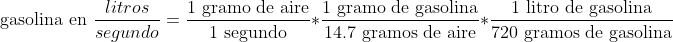

# Uso Básico de la Librería
Cada función está debidamente comentada, pero para no adentraros en código, resumo las funciones. 

`Declaración: Smart(rs, en, d4, d5, d6, d7, port, e1, e2, eb, minimumSpeed)`

- `sos()`: Función de recuperación de errores. Util para meterlo dentro de un except.
- `startTurboCare(actualTime)`: Establece el inicio para realizar el descanso de un minuto en parado para refrigerar el turbo.
                                Recomendado ejecutarse en cada iteración y asi no depender de que menu nos encontramos.
- `turboCare(actualTime)`: Función menú que muestra el tiempo que queda de refrigeración de turbo y coolant temp. Depende de startTurboCare()
- `getStopped()`: Devuelve valor indicando si estamos parados o no.
- `getRotatory(menu)`: Pasando la cantidad de menus, comprueba si se ha girado el rotary y cambia a ese menu.
- `getButtonRotatory()`: Devuelve valor indicando si se ha pulsado el boton del rotary.
- `getOBDData()`: Función que obtiene todos los valores de OBD, se puede añadir cuantos se quieran, consultar python-OBD docs, para conocer todos los sensores.
- `fuelScreen()`: Función menu que muestra consumo instantáneo, promedio y las RPM.
- `rpmCoolScreen()`: Función menu que muestra RPM y Coolant temp.
- `rpmScreen()`: Función menu que muestra RPM y segments racing.

### Nota sobre cálculo de consumo de combustible
Debido a que la ECU del Smart no me deja acceder a los inyectores, he aproximado el consumo extrayendo los datos
del sensor MAF (sensor que indica el caudal de aire que entra en la admisión en gramos/segundo), a partir de ahí
he supuesto que la ECU hace los cálculos pertinentes para garantizar una mezcla estequiométrica y (mediante un sencillo factor de conversión)
he podido suponer la cantidad de combustible que se está inyectando en todo el motor.

Finalmente he tenido en cuenta la posición del acelerador debido a que la mariposa
de admisión no se cierra por completo nunca y por tanto sin acelerar, había consumo.
