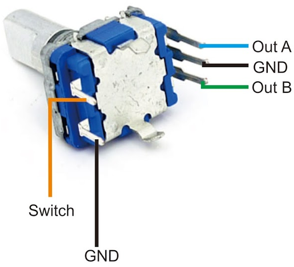

# Actual Pinout
Pinout specified in BCM Nomenclature.

## LCD:

|                |PIN                            |
|----------------|-------------------------------|
|D7								|`GPIO 14`            |
|D6								|`GPIO 15`            |
|D5								|`GPIO 18`|
|D4								|`GPIO 23`|
|Enable								|`GPIO 24`|
|RegisterSelector								|`GPIO 25`|

## Rotary Encoder:

|                |PIN                            |
|----------------|-------------------------------|
|OutA								|`GPIO 20`|
|OutB								|`GPIO 16`|
|Pulsar								|`Button`|
