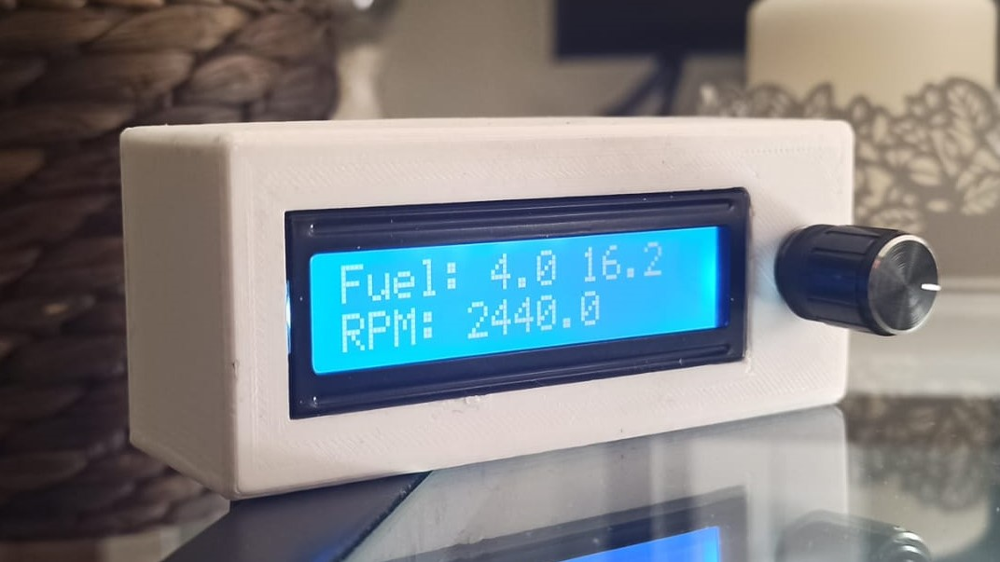
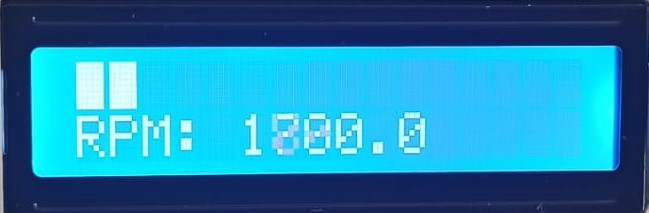
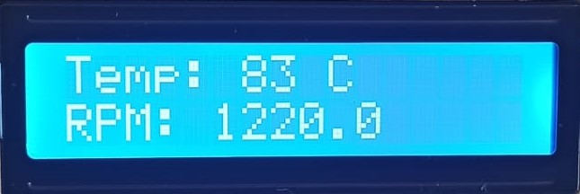
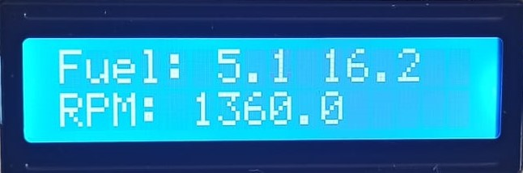
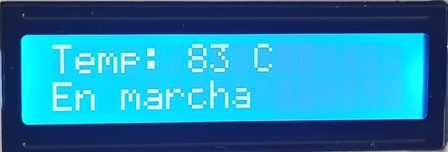

# CuentaRevoluciones
Cuentarrevoluciones hecho con RPi zero W con pantalla lcd 16x2 y rotary-encoder. Funciona mediante OBDII.

### Objetivos
Mi Smart Fortwo solo tiene cuentarrevoluciones si lo pagas como un extra, el mío no vino con ese extra y no me apetece pagar más por él así que decidí hacerme uno utilizando el protocolo
 OBD-II.
La idea inicial es solo mostrar las revoluciones del motor pero como veréis, he implementado más cosas.
 
### Qué es? Cómo funciona?

Todo el programa esta escrito en Python3 y ejecutado en una RaspberryPi Zero W (versión con WiFi y Bluetooth).

La conexión al puerto OBD se realiza mediante Bluetooth y la librería python-OBD.

La pantalla utilizada es la típica LCD de 16x2 píxeles y adicionalmente utiliza un Rotary encoder para poder navegar entre distintos menús.

### Funciones Actuales
Actualmente el programa puede mostrar:
- RPM del motor.

- Temperatura del Refrigerante.

- Consumo de gasolina (aproximado gracias al sensor MAF).

- Tiempo de parada para cuidar el turbo.

## Información Adicional

### Librerías

#### LCD Library
Librería para controlador **ST7066U** hecha por mí. Al ser más específica que la Adafruit funciona a mayor velocidad.

#### Rotary encoder Library
Le he realizado unos cambios para que funcione con el rotary conectado de GPIO -> GND y he añadido la función de un botón para los rotary con botón.

#### Modelos 3D
Modelos 3D en formato stl de la caja en carpeta **Modelos**

#### Conexiones:
Cableados a la RPi en carpeta **Images**

### Productos:
- [Librería OBD original](https://github.com/brendan-w/python-OBD)
- [Librería Rotary encoder original](https://github.com/nstansby/rpi-rotary-encoder-python)
- [Librería original LCD Adafruit](https://github.com/adafruit/Adafruit_Python_CharLCD)
- [Pantalla](https://es.aliexpress.com/item/32397063365.html?spm=a2g0o.productlist.0.0.779a3a31I4vpfB&algo_pvid=adf133c7-1ed9-4de1-b14b-2ab022e3496c&algo_exp_id=adf133c7-1ed9-4de1-b14b-2ab022e3496c-3&pdp_ext_f=%7B%22sku_id%22%3A%2212000026861398048%22%7D&pdp_pi=-1%3B1.9%3B-1%3B-1%40salePrice%3BEUR%3Bsearch-mainSearch): LCD 1602
- [Obd](https://es.aliexpress.com/item/4000809053108.html?spm=a2g0o.productlist.0.0.70e571ackddOMQ&algo_pvid=ea560480-3cf9-416e-9c37-55a7fe459be6&algo_exp_id=ea560480-3cf9-416e-9c37-55a7fe459be6-1&pdp_ext_f=%7B%22sku_id%22%3A%2212000025091114231%22%7D&pdp_pi=-1%3B4.22%3B-1%3B-1%40salePrice%3BEUR%3Bsearch-mainSearch): elm327
- [Rotativo](https://es.aliexpress.com/item/4000028678187.html?gatewayAdapt=glo2esp&spm=a2g0o.9042311.0.0.274263c0LgHA3h)

### Enlaces de interés OBD:
Para programarlo todo, he utilizado un OBD-II virtual el cual te ahorra bastante tiempo, ya que no necesitas bajar directamente al coche.
- [OBD VIRTUAL](https://github.com/Ircama/ELM327-emulator)

OBD II Codes.
- [OBD PIDs](https://en.wikipedia.org/wiki/OBD-II_PIDs)

### Raspberry AP:
Este programa permite utilizar la Raspberry como punto de anclaje Wi-Fi y de esta manera poder meter actualizaciones 
sin necesidad de sacar la Rpi de la caja.
- [raspberry](https://www.raspberrypi.com/documentation/computers/configuration.html#setting-up-a-routed-wireless-access-point)

### TODO:
#### IDEAS:
- Boton pulsado 10s, entra en modo debug y el wifi de la raspberry se enciende.

#### FASE PRUEBAS:
- Litros de combustible restantes en el tanque.
